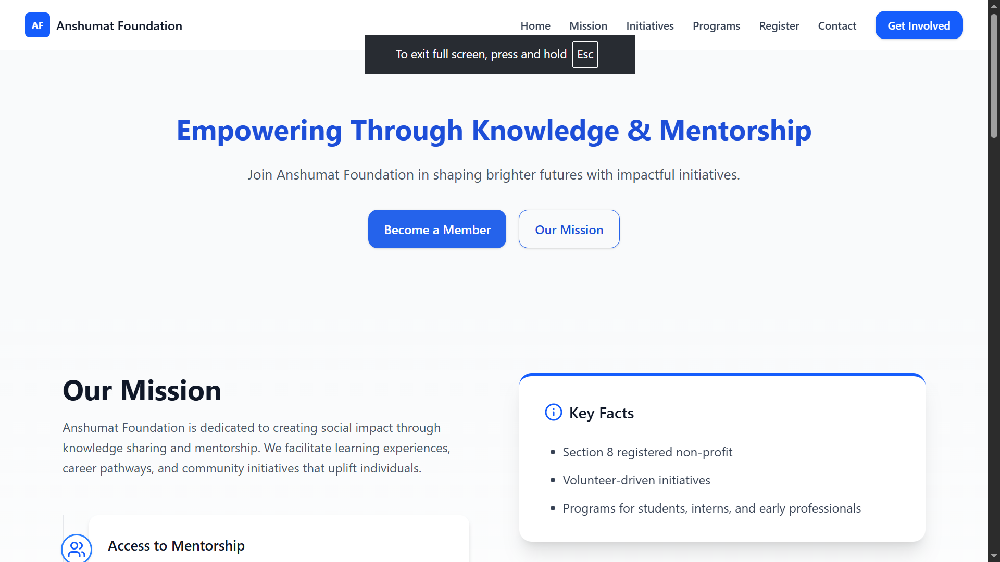
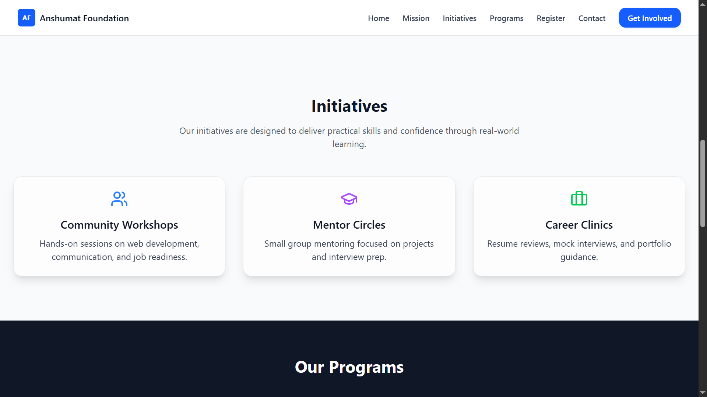
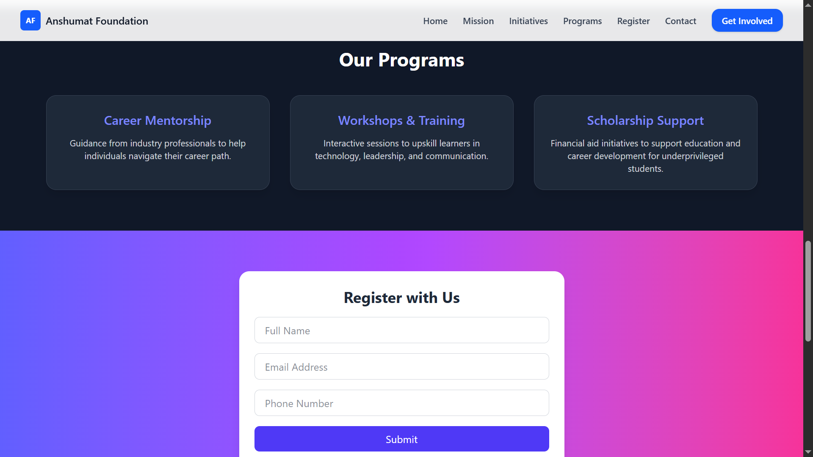

# Anshumat Foundation - Official Website (Improved Version)

Anshumat Foundation is a Section 8 non-profit organization dedicated to empowering individuals through **knowledge, mentorship, and career development**. This is the improved official website built with modern web technologies to reflect trust, social impact, and professionalism.

🌐 **Live Preview**: [https://anshumat.org](https://anshumat.org) *(example link — replace with actual if deployed)*

---

## 📸 Screenshots

### 🏠 Home Page

### 🎯 Mission Section

### 📚 Programs Section

---

## 🎯 Project Overview

This website redesign focuses on:
- Clean, professional UI/UX
- Clear communication of mission and impact
- Easy access to programs and registration
- Fully responsive design for all devices

The site serves as a digital hub for students, mentors, volunteers, and donors to connect and contribute to meaningful change.

---

## 🛠 Tech Stack

- **Frontend Framework**: React + Vite
- **Styling**: Tailwind CSS (v4)
- **Icons**: Lucide React
- **Build Tool**: Vite
- **Responsive Design**: Mobile-first approach
- **Deployment Ready**: Static site export supported

---

## 📦 Features

✅ **Modern & Professional Design**  
Clean layout with consistent typography, spacing, and color scheme that reflects trust and credibility.

✅ **Key Sections Included**  
- **Hero Section**: Strong headline with clear call-to-action  
- **Mission**: Clearly defined purpose and core values  
- **Initiatives**: Community Workshops, Mentor Circles, Career Clinics  
- **Programs**: Career Mentorship, Workshops & Training, Scholarship Support  
- **Registration Form**: For users to get involved  
- **Contact Form**: For inquiries and feedback  

✅ **Fully Responsive**  
Seamlessly adapts to desktop, tablet, and mobile devices with intuitive navigation and readable content.

✅ **Accessibility & UX**  
Semantic HTML, keyboard navigation support, and accessible forms ensure inclusivity.

✅ **Performance Optimized**  
Built with Vite for fast development and production builds.

---

## 🧭 Navigation

The website includes smooth navigation via:
- Desktop menu with hover effects
- Mobile-friendly hamburger menu
- Anchor links to key sections (Home, Mission, Programs, etc.)

---

